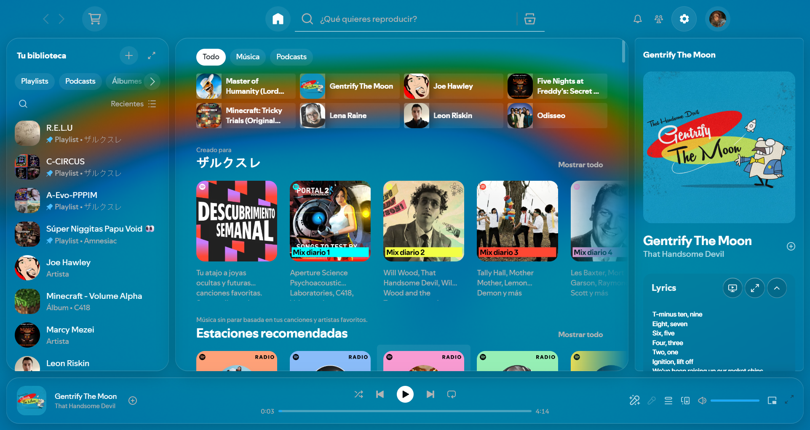

# Clair-SpicyTheme

Spicetify theme with an animated cover art background behind the whole app and glass panels.

- **Light** (default) or **Dark**: bright cover colors with see-through panels, or dimmed colors with deeper panels. Blur, Warp, Motion, Saturation and Brightness stay adjustable.
- **Sync with Spicy Lyrics**: shown only when Spicy Lyrics is installed. When on, Clair uses the Spicy Lyrics background (same shader, blur, saturation, dithering, brightness filter and tempo/beat speed) and follows its settings live, including the static Auto, Artist Header, Cover Art and Color modes and blur. The background is mapped onto the lyrics panel exactly like Spicy draws it, so the lyrics page and the rest of the app form one continuous background.

The accent follows the current cover through the same Spotify dynamic colors (`getDynamicColorsByUris`) that Spicy Lyrics uses.



## Install from Marketplace

Open Spicetify Marketplace, go to Themes, search for **Clair-SpicyTheme** and click Install. To use Sync with Spicy Lyrics, also install the Spicy Lyrics extension from Marketplace.

## Install manually (Windows)

```powershell
powershell -ExecutionPolicy Bypass -File .\INSTALL.ps1
powershell -ExecutionPolicy Bypass -File .\INSTALL.ps1 -Scheme Clair-OLED
```

The installer runs `spicetify backup` first and moves any previous copy of the theme to `Clair-SpicyTheme.bak-<timestamp>`.

## Settings

Click the gear button next to your avatar (top right). The window uses the same layout as the Spicy Lyrics settings: a Light / Dark picker, a search box, then these sections:

| Section | Options |
| --- | --- |
| Background | Background on or off, Sync with Spicy Lyrics (when installed; shows its current background and a button to open its settings), otherwise Blur, Warp, Motion, Saturation, Brightness |
| Glass | Panel opacity, Glass blur, Corner radius |
| Color | Accent (cover art, presets or custom), Custom color, Surface tint |
| More | Window controls (Default, Clair glass, or No controls), Minimal mode (hides friend activity), Maximum performance, Reset |

Changes apply instantly and persist. Console: `ClairTheme.openSettings()`.

## Uninstall

```powershell
powershell -ExecutionPolicy Bypass -File .\UNINSTALL.ps1
powershell -ExecutionPolicy Bypass -File .\UNINSTALL.ps1 -FullRestore
```

After a Spotify update breaks styling: `spicetify restore backup apply`, then `spicetify backup apply`.

## Schemes

`Clair-Dark` (default) and `Clair-OLED` (pure black). Their `button` color is the fallback accent when cover colors are unavailable.
